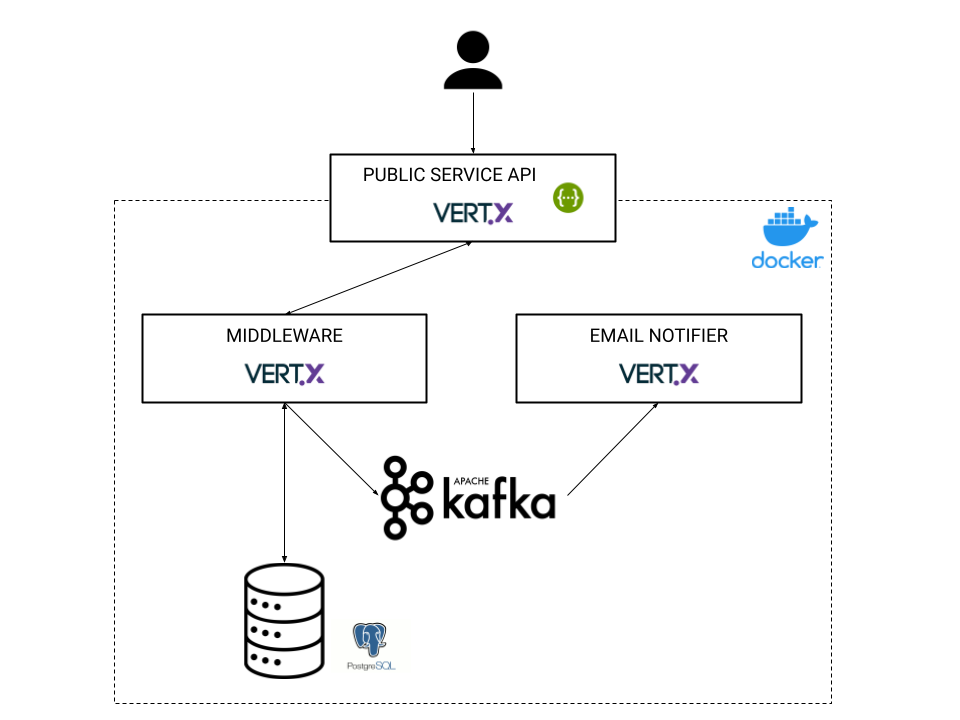

# Subscription System

[](https://vertx.io)

## Index

- [Summary](#Summary)
    - [Architecture](#architecture)
- [Description](#description)
    - [Overall](#overall)
    - [API Public Service](#api-public-service)
    - [Kafka Mock](#kafka-mock)
    - [Middleware](#middleware)
    - [Email Notifier](#email-notifier)
- [How to work](#how-to-work)
    - [How to test](#how-to-test)
    - [Set up](#set-up)
    - [How to run](#how-to-run)
- [Future](#future)    
    
## Stack info
- Java 11
- Vertx 4
- Maven 3.6.3
- Docker 20.10.8

## Summary

The main function of this set of services is to build a user subscription system, including: an API
, business logic with storage and email notifications.

### Architecture


## Description

### Overall
- The solution consists of 3 independent microservices that can be easily adapted to be reused in other systems.
- All deployments are handled by docker. Also everything is under an internal network so only the public service API is exposed to the user.
- The storage is simulated with PostreSQL using docker.
- A Kafka via docker is used to manage notifications.
- All microservices have a **dev_config.yaml** file that is used in deployments, so that it would be easy to use the microservices in other environments in the future.
- All system commands are included in a [Makefile](Makefile) for ease of use.

### API Public Service [](https://vertx.io)

The service has an API deployed which is defined in [swagger.yaml](public-service/src/main/resources/swagger.yml). There are 5 operations:

There are some Postman examples [here](docs/subscription-system.postman_collection.json).

**Important**: It is assumed that we are in a logged service using OAuth2 authorization (or similar) so all requests to the API must have an "access_token" header.

#### /health
A request operation to check if the service is alive.

#### /subscription
A request to create a subscription into the system.

You can find an example in [subscription_example.json](docs/subscription_example.json).

You can't create a subscription with the same email and id more than one time.

The id is returned as a response in case of success.
#### /cancel/subscription_id
A request to cancel a subscription by subscription and email (indicates as header).

The id is returned as a response in case of success.

#### /subscription/subscription_id
A request to get a subscription by subscription and email (indicates as header).

The subscription is returned as a response in case of success.

#### /all
A request to get a set of subscriptions by email (indicates as header).

The set of subscriptions is returned as a response in case of success.

### Kafka Mock
For our service we do not have a real instance of Kafka, 
so we will use a test environment through [Docker](/kafka-mock).

This instance of Kafka is within the internal network and will be used by the Middleware service to indicate that there are notifications to be sent. 
Subsequently, the Email Notifier service will consume these notifications and send (dummy) the emails.

### Middleware
The service has an internal API to communicate with the Public Service.

The service communicates with a PostgreSQL database that is instantiated through its docker-compose.

This database is restarted each time the service is started and created with the next [schema](/middleware/resources/subscription_dump.sql).

The service is designed with Hexagonal Architecture (Ports and Adapters pattern) to be able to change the storage system whenever you want.

### Email Notifier
The purpose of this service is only to consume Kafka elements to send notifications. 

The email sending part has been simulated.

## How to work

### How to test
Some tests have been included in the Public-Service (unitary) and Middleware (ATDD Cucumber and Gherkin acceptance) services.

**Important**: a few of each type have been included but should be completed in the future to cover all cases and functions.

To run the unit public-service tests:
```shell script
make public-service-test
```

To run the acceptance middleware tests:
```shell script
make middleware-test
```

### Set up
It is important that Kafka is running when all other services are running:
```shell script
make kafka-up
```

Also Public Service must be deployed first because its docker contains the internal network that will be used by the rest of the services.
```shell script
make public-service-up
```

### How to run
We continue with the rest of the services:
```shell script
make middleware-up
```

```shell script
make email_notifier-up
```

At this point the system is available to receive requests.

**Important**: Each service has a command with suffix "-down" for a correct shutdown.

## Future
- Include more unit and acceptance test
- Include the Abstract Factory design pattern in all microservices.
- Complete the documentation of the API and its responses.
- Include more logs.
- Enabled different environment configuration files.
- For layer communication (inside code) use functions with asynchronous future instead of different event buses.
- Migrate to gradle/bazel instead of maven.
- Monitor metrics and resources.


